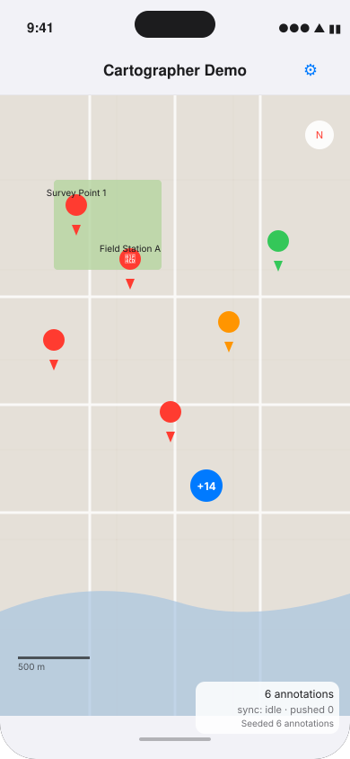
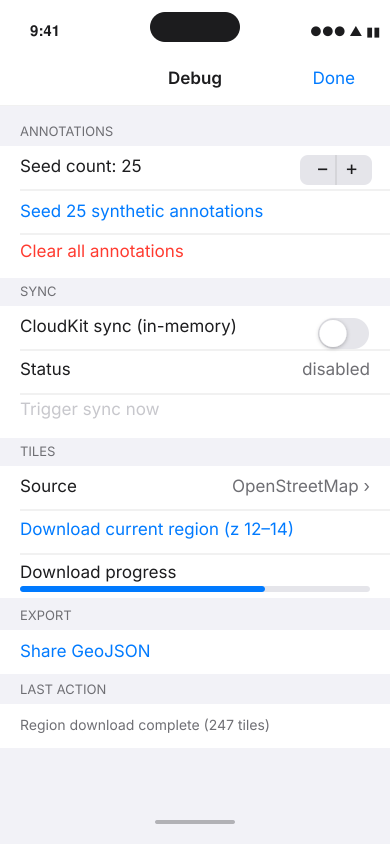

# Cartographer

**An offline-first collaborative map annotation engine for Apple platforms.**

---

## Overview

Cartographer lets users annotate maps — pins, routes, polygons, field notes — that work completely offline and sync conflict-free across devices using CRDTs when connectivity returns. It is built for field researchers, hikers, geologists, and anyone who needs maps that survive without cell service.

The engine is a zero-dependency Swift Package. It combines a custom R-tree spatial index for sub-10ms range queries, a Hybrid Logical Clock-based CRDT operation log for deterministic conflict resolution, a SQLite tile cache with WAL mode, and a CloudKit sync layer that requires no infrastructure beyond an Apple developer account.

`CartographerDemo` is the reference iOS app that exercises every engine component on a real device. Use it to smoke-test any engine change end-to-end before merging. See [CartographerDemo](#cartographerdemo--ios-reference-app) below.

```
┌─────────────────────────────────────────┐
│              SwiftUI Views              │
├─────────────────────────────────────────┤
│         MapCoordinator (@MainActor)     │
├──────────┬──────────┬───────────────────┤
│ TileEngine│Annotation│   SyncEngine     │
│          │ Engine   │                   │
├──────────┴──────────┴───────────────────┤
│         CRDT Operation Log              │
│    (HLC + LWW-Register + OR-Set)        │
├─────────────────────────────────────────┤
│     SQLite (WAL mode) + R-Tree          │
└─────────────────────────────────────────┘
```

---

## Features

| Feature | Details |
|---------|---------|
| **Offline-first** | Every annotation read and write goes through local SQLite; network is never on the critical path |
| **CRDT sync** | Hybrid Logical Clocks + LWW-Register fields + OR-Set collections; two devices can diverge for weeks and merge deterministically |
| **Custom R-tree** | Pure Swift spatial index; Sort-Tile-Recursive bulk load, kNN, range queries over 10K+ annotations at <10ms |
| **Tile caching** | SQLite-backed tile cache with WAL mode; supports OpenStreetMap, OpenTopoMap, and custom tile sources |
| **CloudKit sync** | Zero infrastructure; uses CloudKit private database zones with incremental change tokens |
| **GeoJSON / KML export** | Export any project snapshot to GeoJSON or KML for external tooling |
| **Zero dependencies** | Foundation + MapKit + CloudKit + SQLite3 (system-provided); no SPM dependencies |
| **Harness-driven** | Every component has a behavioral harness that serves as both spec and regression guard |

---

## Quick Start

### SPM Integration

```swift
// Package.swift
dependencies: [
    .package(url: "https://github.com/garnathdynamics/cartographer.git", from: "0.2.0")
],
targets: [
    .target(name: "YourTarget", dependencies: ["Cartographer"])
]
```

### Create and sync annotations

```swift
import Cartographer

// Bootstrap the engine
let clock = HLCClock(nodeID: myDeviceID)
let log   = OperationLog(path: dbPath)
let engine = AnnotationEngine(clock: clock, operationLog: log)

// Drop a pin — works entirely offline
let pin = try await engine.create(
    type: .pin,
    coordinate: GeoCoordinate(latitude: 37.7749, longitude: -122.4194),
    title: "Field Station A",
    body: "Soil sample collected",
    projectID: projectID
)

// Query nearby annotations (R-tree range query, <10ms at 10K annotations)
let bbox = BoundingBox(
    minLatitude: 37.70, maxLatitude: 37.85,
    minLongitude: -122.55, maxLongitude: -122.35
)
let nearby = try await engine.annotations(in: bbox, projectID: projectID)

// Sync with CloudKit when online (push local ops, pull remote ops, converge via CRDT)
let sync  = SyncEngine(transport: cloudKitTransport, operationLog: log)
let unsynced = try await log.unsynced()
let remote   = try await sync.sync(localUnsynced: unsynced)
```

---

## CartographerDemo — iOS Reference App

`CartographerDemo/` is the v0.2.0 reference app. It exercises every engine component — tile caching, annotation CRDT operations, sync state machine, GeoJSON export — on a real iPhone.

<table>
<tr>
<td align="center" width="50%">



**Map view with annotations**<br/>
Long-press to drop a pin. Status badge (bottom-right) shows live annotation count and sync state.

</td>
<td align="center" width="50%">



**Debug menu (wrench icon)**<br/>
Seed synthetic annotations, toggle CloudKit sync, switch tile sources, download a region offline.

</td>
</tr>
</table>

### Build and run

**Command line (no signing required):**

```bash
xcodebuild \
  -project CartographerDemo/CartographerDemo.xcodeproj \
  -scheme CartographerDemo \
  -destination 'generic/platform=iOS' \
  -configuration Debug \
  CODE_SIGNING_ALLOWED=NO CODE_SIGNING_REQUIRED=NO \
  build
```

**On a real iPhone (iOS 17+):**

1. Open `CartographerDemo/CartographerDemo.xcodeproj` in Xcode 16+.
2. Select your signing identity under *Signing & Capabilities* (bundle id: `com.garnathdynamics.cartographer.demo`).
3. Pick the attached device and hit Run.

**Debug menu features (wrench icon, top-right):**

- Seed up to 500 synthetic annotations around San Francisco
- Toggle CloudKit sync (uses an in-memory transport — no iCloud account required to demo)
- Switch tile source: OpenStreetMap ↔ OpenTopoMap
- Download a region offline (zoom 12–14 over the SF Bay area)
- Share GeoJSON of the current project via system share sheet

> **Accessibility gate.** Before merging engine changes to `main`, run the demo with VoiceOver enabled and verify tap-to-add-pin announces correctly per `docs/design/v0.2.0/06-voiceover-tap-to-add-pin.md`. Accessibility is a first-class merge gate.

---

## Architecture

```
Sources/Cartographer/
├── Core/           # Types, protocols, errors — no dependencies
├── CRDT/           # HLC, LWW-Register, OR-Set, Operation, OperationLog
├── Spatial/        # R-tree, BoundingBox queries
├── TileEngine/     # TileCache, CachingTileOverlay, RegionDownloader
├── Annotations/    # AnnotationEngine, SmartAnnotationService, clustering
├── MapUI/          # MapView, MapCoordinator, MapClusterer
├── Sync/           # CloudKit transport, SyncEngine, SyncState
└── Export/         # GeoJSONExporter, KMLExporter

Tests/CartographerTests/
├── Harness/        # Source-of-truth behavioral contracts (do not modify)
├── Benchmarks/     # Performance regression tests
└── */              # Unit tests per module

CartographerDemo/
├── CartographerDemo/            # SwiftUI iOS app sources
├── CartographerDemo.xcodeproj/  # Checked in; authoritative for xcodebuild
└── project.yml                  # XcodeGen mirror; diff-friendly spec
```

See [docs/ARCHITECTURE.md](docs/ARCHITECTURE.md) for the full architecture document, import rules, and concurrency model.

Key technical decisions are captured in [docs/adr/](docs/adr/):
- [ADR-001](docs/adr/ADR-001-raw-sqlite.md) — Raw SQLite3 C API (no wrappers)
- [ADR-002](docs/adr/ADR-002-custom-rtree.md) — Custom R-tree vs. Core Data / GRDB
- [ADR-003](docs/adr/ADR-003-crdts.md) — CRDT design: HLC + LWW + OR-Set
- [ADR-004](docs/adr/ADR-004-cloudkit.md) — CloudKit as sync transport
- [ADR-005](docs/adr/ADR-005-harness-driven.md) — Harness-driven development
- [ADR-006](docs/adr/ADR-006-demo-app-structure.md) — CartographerDemo companion app structure

---

## API Reference

| Type | Kind | Purpose |
|------|------|---------|
| `AnnotationEngine` | `actor` | Create, update, delete, and query annotations; manages the R-tree index |
| `OperationLog` | `actor` | Append-only SQLite log of CRDT operations; source of truth for all state |
| `SyncEngine` | `actor` | Push unsynced operations and pull remote operations via a `SyncTransport` |
| `TileCache` | `actor` | SQLite-backed tile store; read/write individual tiles, evict by coordinate |
| `RTree<Element>` | `struct` | Pure-Swift R-tree; bulk load, range query, kNN, insert/remove |
| `HLCClock` | `struct` | Hybrid Logical Clock; monotonic timestamp with causal ordering across nodes |
| `LWWRegister<T>` | `struct` | Last-Writer-Wins register; used for individual annotation fields |
| `ORSet<Element>` | `struct` | Observed-Remove Set with add-wins semantics; used for annotation collections |
| `Annotation` | `struct` | Sendable, Codable annotation model: id, coordinate, title, body, type, timestamps |
| `GeoCoordinate` | `struct` | Sendable latitude/longitude pair |
| `BoundingBox` | `struct` | Axis-aligned bounding box for spatial queries |
| `TileCoordinate` | `struct` | Slippy-map tile coordinate (z, x, y) |
| `GeoJSONExporter` | `struct` | Exports annotation arrays to GeoJSON `FeatureCollection` |
| `KMLExporter` | `struct` | Exports annotation arrays to KML `Document` |
| `TileSource` | `protocol` | Supply tile URLs; conform to add custom tile providers |
| `SyncTransport` | `protocol` | Abstract sync channel; the CloudKit transport conforms to this |

---

## Performance

All targets measured on iPhone 15 Pro (A17 Pro), iOS 17, Debug build.

| Operation | Target | Notes |
|-----------|--------|-------|
| Tile cache read (SQLite) | < 5ms | WAL mode, prepared statement |
| Tile cache write | < 10ms | Parameterized binding, no fsync |
| R-tree range query (10K annotations) | < 10ms | In-memory index |
| R-tree insert | < 1ms | Quadratic split |
| R-tree bulk load (10K entries) | < 100ms | Sort-Tile-Recursive |
| CRDT merge (1K operations) | < 50ms | LWW + OR-Set convergence |
| HLC timestamp generation | < 1μs | Struct, no heap allocation |
| Operation log append | < 2ms | WAL, prepared statement |
| Map pan with 5K annotations | < 16ms | 60fps frame budget |
| Full sync cycle (100 ops) | < 500ms | CloudKit round-trip excluded |

Run benchmarks: `swift test --filter BenchmarkTests`

---

## Roadmap

Cartographer follows a milestone-based roadmap prioritising offline reliability above all else.

**Upcoming milestones:**

| Version | Theme |
|---------|-------|
| v0.3.0 | Sync hardening — partial resumption, tombstone compaction, drift detection |
| v0.4.0 | R-tree at scale — persistent index, 100K-entry benchmarks, kNN bounds |
| v0.5.0 | Offline edge cases — tile eviction policy, background pre-fetch, queue drain |
| v0.6.0 | Collaboration — shared CloudKit zones, presence, per-field authorship |
| v1.0.0 | Platform expansion — macOS Catalyst, iPadOS split-view, SwiftUI Map API |

See [docs/ROADMAP.md](docs/ROADMAP.md) for full milestone details and deferred items.

---

## Requirements

- **Swift** 6.0+
- **Platforms** iOS 17+ / macOS 14+
- **Xcode** 16+ (for demo app)
- **Dependencies** Zero external. Apple system frameworks only: MapKit, CloudKit, SQLite3, CoreLocation.

---

## Installation

### Swift Package Manager

```swift
// Package.swift
dependencies: [
    .package(url: "https://github.com/garnathdynamics/cartographer.git", from: "0.2.0")
]
```

Or in Xcode: **File → Add Package Dependencies** and enter the repository URL.

---

## Building & Testing

```bash
swift build                                    # Build library
swift test                                     # All tests
swift test --filter CRDTHarnessTests           # CRDT correctness harness
swift test --filter TileHarnessTests           # Tile engine harness
swift test --filter RTreeHarnessTests          # Spatial index harness
swift test --filter SyncHarnessTests           # Sync convergence harness
swift test --filter BenchmarkTests             # Performance benchmarks
```

The harnesses in `Tests/CartographerTests/Harness/` are the authoritative behavioral contracts. If a harness fails, the implementation is wrong — never modify a harness to make it pass.

---

## Contributing

See [CONTRIBUTING.md](CONTRIBUTING.md) for full guidelines. The short version:

```
/onboard          # Load project context in Claude Code
/story CG-005     # Pick a story from docs/PRD.md and implement it
```

Feature branches: `feat/CG-XXX-description`. Every PR must pass all harnesses and include benchmark deltas.

---

## License

MIT — see [LICENSE](LICENSE).

Copyright © 2026 GARNATH Dynamics.
